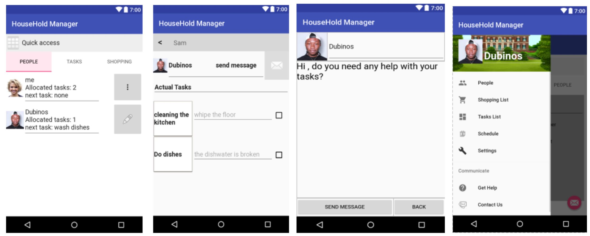

# HouseHold Manager App
## Description
HouseHold Manager is an application for Android devices that manages households tasks.

## Features
* log in 
* log out
* register
* reset password
* adding and removing items to shopping lists. 
* assigning tasks to users
* Take a picture from phone Camera

## Technologies Used
This app is built using:

* SQLlite database to save users, tasks and items on the list
* Android fragments and activities.
* JAVA
* XML

## User Interfaces screenshots

## FrontEnd Development Environment Setup Guide

Please follow those instruction fto set up your local work environment for the front-end. 

1. Download Android studio: https://developer.android.com/studio 
2. Clone the repo using HTTPS or SSH: `$ git clone https://github.com/easinyo/HouseHoldManager
3. Open the project on Android studio and you are good to go. 

Learn more about Android studio and Android developement: https://developer.android.com/guide
